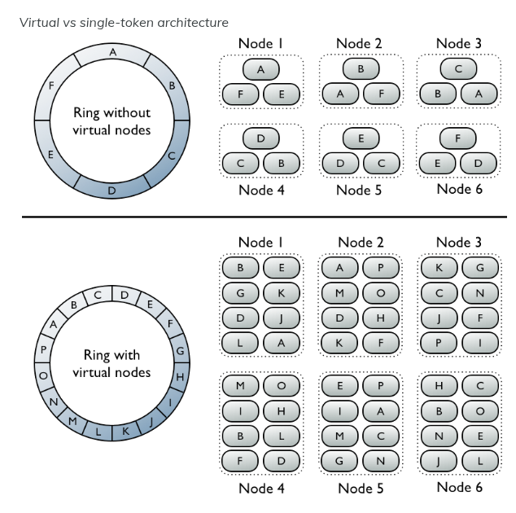

# Distributed Task Queue partitioning and Rebalancing

## 🇺🇸 EN

## 🇧🇷 PT-BR

## O que é

É uma fila de tarefas distribuídas, que automaticamente se particiona e faz rebalanceamento.

Aqui, vamos ter múltiplas filas no Redis, e vamos ter workers em processos diferentes, se coordenando simultaneamente. Um worker vai pegar uma tarefa da fila, vai processar e depois pegar a próxima.

### Cenário

Imagina que temos um sistema que precisa processar **milhares de tarefas por segundo.** Como:

- Processar imagens
- Enviar e-mails
- Gerar relatórios

Qualquer tarefa que pode demorar algum tempo. Se fizermos isso em apenas um servidores, ele não daria conta, ia entrar em sobrecarga, dependendo do nível de escala. Então, precisamos distribuir esse trabalho entre vários servidores.

### Problemas

Mas existem **problemas**:

- Como coordenar isso?
- Como garantimos que cada tarefa seja processada exatamente uma vez?
- Como dividimos o trabalho de forma justa entre os servidores?
- O que acontece quando um servidor morre ou quando adicionamos servidores novos?

### Abordagens possíveis

Podemos resolver esses problemas das seguintes formas:

1. Ter um Coordenador central, uma entidade centralizada que coordena todos os trabalhos. Porém tem um problema nessa abordagem, essa entidade central é um ponto único de falha e um gargalo ao sistema. Se ele falhar o sistema todo falha e perdemos em **disponibilidade.** (availability - CAP)
2. A segunda abordagem é ter um sistema onde os próprios workers se coordenam entre si, sem entidade central, se rebalanceando de forma dinâmica e inteligente. Essa é a abordagem desse projeto.

### Ideias Centrais desse projeto

Aqui temos 3 ideias centrais:

1. Usar **particionamento:** dividir todas as tarefas possíveis em 256 grupos fixos, chamados **partitions**.
2. Usar **consistent hashing:** para decidir qual worker é responsável por quais partitions de forma determinística. Ou seja, um roteamento preciso para o sistema.
3. Usar **etcd**: para os workers se descobrirem e coordenarem quem está vivo no cluster.

Dessa forma, os **workers** podem olhar ao etcd e ver quem está vivo, roda o mesmo algoritmo de consistent hashing e todos chegam na mesma conclusão sobre quem deve processar quais partitions. É um **consenso - consensus protocol**.

### Implementação

#### Consistent Hashing

Para distribuir e redistribuir as tarefas entre os nodes (workers), de forma dinâmica foi escolhido o Consistent Hashing. Existem outras formas para se chegar ao particionamento, porém essa estrutura de dados se mostra otima nesse cenário de redistribuição dinâmica, onde precisamos de sincronização entre os nodes e eles podem parar ou falhar...

##### Fluxo

**Fluxo Criação de Task**

.:. Aqui não temos o consistent hashing, apenas à título de explicar a dinâmica...

1. Task chega com um ID / nome
2. É feito um hash a partir do ID / nome da task
3. Se faz partition = hash % 256 (quantidade de partitions). O valor resultante desse restante será a partition de destino na fila.
4. Push na fila, com a task na partition correta.

**Descobrindo quais partitions e tasks são do worker**

No consistent hashing... Worker side.

fluxo: vnode -> partition -> tasks

**Big O**: O(P log V), onde P = partitions, V = vnodes.
    Acontece apenas quando mudança de membership ocorrem (bootstrap de worker exclusão de worker), então o overhead é mínimo comparado com o throughput de processamento de tasks.

Para um worker qualquer (e.g. worker-A) saber o que deve ser processado, ele irá:

1. Chamar GetPartitionsForNode("worker-A)
2. GetPartitionsForNode faz 256 iterações (ou quantas partitions tivermos - isso só ocorre quando um novo worker entra ou sai do etcd).
    Para a partition 0:
    - Hash "partition:0" -> obtem hash 123456
    - Busca no ring o **primeiro vnode >= 123456** (primeiro vnode hash >= hash da partition desejada).
    - Encontra vnode hash 150000 -> esse vnode pertence a "worker-B"
    - Partition 0 NÃO é do worker-A, é de outro, então vai ignorar

    ...

    Para partition 42:
    - Hash "partition:42" -> obtém hash 999999
    - Busca no ring o primeiro vnode >= 999999
    - Encontra vnode com hash 1200000 -> esse vnode sim pertence a "worker-A"

    ... itera 256 vezes (por todas partitions)
3. Retorna: [5, 7, 23, 42, 58, ...] <- todas partitions que pertencem a worker-A
4. Worker-A faz BLPOP em ["tasks:5", "tasks:7", "tasks:23", "tasks:42", ...]
5. Tasks que chegarem nessas partitions no Redis (pela fila) são processadas pelo worker-A sempre.

##### Trade-offs:

**Random Assingment**

Nesse formato, os dados seriam distribuidos de forma randômica. Porém, o client não sabe em qual node está o nó, não sendo possível a re-distribuição dinâmica.

**Cache Global Único**

Essa estrutura é rápida. Porém tem problemas de escala e fica complexo administrar devido ao cache miss.

**Key Range** - intervalo de chaves

O client pode obter facilmente os dados do server, porém a distribução de chaves entre os nodes não é boa, que pode sobrecarregar um node especifico e deixando outros ociosos.

**Static Hashing**

Usa um identificador, como IP ou algo do tipo. Os nodes são armazenados em um array e o módulo do hash service compuita o hash e a chave de dados. Problema: se um node quebrar, é complicado para redistribuir as partições entre os nodes que ainda existem. Adicionar novos nodes também é complexo.

**Consistent Hashing**

Essa é uma estrutura inteligente, ela tem um hash ring que minimiza o número de chaves para ser remapeado quando o número de nodes mudarem. Basicamente, a estrutura de anel terá cada node posicionado em um local dele, e nossa função hash vai mapear para uma posição do anel. Ao chegar no anel, se Não encontrou o node diretamente, a estrutura é atravessada em sentido horário do anel, até encontrar o node mais pŕoximo. Se um node quebrar, tudo que era de sua responsabilidade passa para o próximo node (que já é a travessia em si).

Essa estrutura é bascamente uma **BST - Binary Search Tree**. Dessa forma conseguimos inserção, busca e remoção em **O(log n)**.

##### Algoritmos de Hash

Inicialmente, foram considerados 3 algoritmos para a hash function:

- SHA256
- Murmur3
- MD5
Todos são amplamente utilizados em tecnologia da informação.

**SHA256**

O SHA256 é uma função Hash criptográfica que produz um tamanho fixo de 256 bits (32 bytes) de hash value a partir de um input de tamanho arbitrário. Ele é muito seguro, usado em protocolos de rede e sistemas, SSL/TLS, assinaturas digitais e blockchains.

Alguns usos comuns seriam:

1. Cryptomoedas
2. Integridade de dados
3. Assinaturas digitais
4. Storage de senhas

**Murmur3**

O MurmurHash é uma função hash não criptográfica, foi feita para ser rápido e eficiente, usado prioritariamente para estruturas que dependem de hash tables onde tem uma performance ótima nessas operações. Ele fornece baixa colisão de dados e altíssima distribuição dos valores de hash. Apesar de não ser criptográfico, tem alta performance e eficiência, um dos motivos de ser usado no Apache Cassandra.

1. Hash tables
2. Processamento de dados
3. Indexação de banco de dados
4. Load Balancing

**MD5**

Também uma função hash muito usada, tem um valor de hash de 128 bits que resultam em 32 caracteres. Apesar de ter sido criado para criptografia, se mostrou não ser tão seguro assim. Esse algoritmo, não oferece a melhor performance, e nem uma segurança otima, e por isso foi descartado.

Portanto, o algoritmo escolhido foi o **murmur3**, tendo em vista que neste cenário de sistemas distribuídos, performance se torna crítico.

##### Partitioning

##### Virtual Nodes

Um conceito muito utilizado hoje em dia ao se fazer consistent hashing, é fazer o uso de **virtual nodes** (vnodes). Vnodes permitem que cada node (no nosso caso os workers) seja dono de um grande número de intervalos de particionamentos, distribuidos ao longo do da Hash Ring.

referência: https://docs.datastax.com/en/cassandra-oss/3.0/cassandra/architecture/archDataDistributeDistribute.html

Os virtual nodes são distribuídos ao longo do ring, e cada virtual node estará atrelado a um worker.

Quando fazemos o hash de uma partition, vamos sempre buscar o primeiro VNode com o hash >= que o hash daquela partition. Achado o VNode, retornamos qual é seu Worker corretamente.